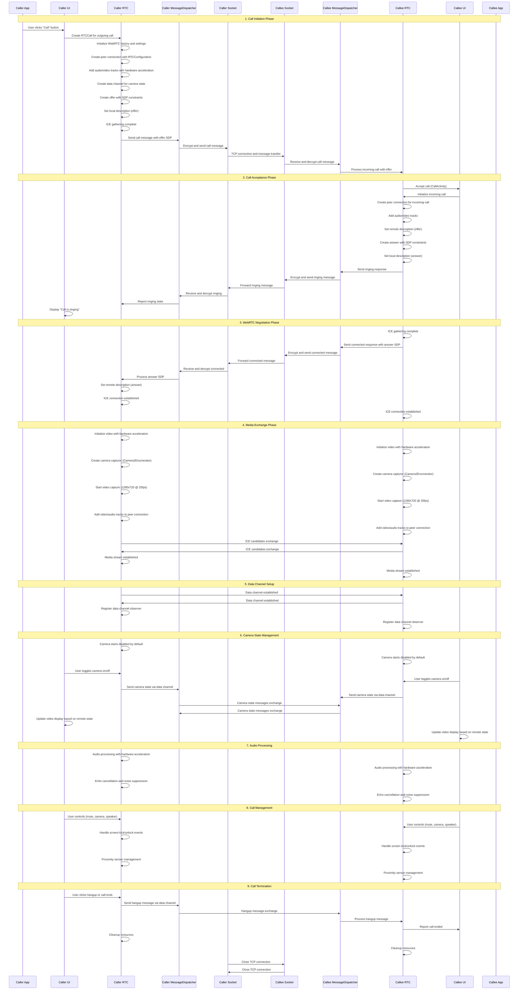

CupLink Documentation
=======================

## Motivation

Currently, the market of VoIP software is dominated by software owned by big companies and tied to central infrastructure and the Internet in order to monetize the platform and control the data flow. On the other side there a various communities (e.g. [Freifunk](https://freifunk.net/), [RiV-mesh](https://github.com/RiV-chain/RiV-mesh), ..) try to establish various kinds of decentralized networks to connect people with alternative pathways even without Internet. Common VoIP software usually does not work there. This is where CupLink can serve as a use case or even "killer" App for these networks.

## Finding Contacts

CupLink has no discovery mechanism by design. Contacts are shared via QR-Code or text blob.

## How It Connects

Connections are established via the addresses that are part of a contact. by default this is only the generated MAC address of the WiFi adapter. The MAC address will be used to generate IPv6 link local and other addresses depending on the current IPv6 prefixes. The addresses in the contact can also be list of IPv4/IPv6 addresses or even domain names. This can be configured manually in the settings.

## Randomised MAC Addresses

By default, CupLink puts the MAC address of the WiFi interface in the QR-code that others will use to call. But if the MAC address changes, other CupLink instances won't be able to reach the local CupLink instance. This behavior is defined by internal settings and settings available to the user:


But, if the MAC address is used that was given by the hardware manufacturer, then Android might not use that in the link local address (fe80::\*), which makes CupLink not work, since others cannot create this IP address from that MAC address only. On the other hand, it then depends on the router to assign an IP address that is based on the MAC address (EUI-64).

For more information see the Android documentation on [MAC Randomization Behavior](https://source.android.com/docs/core/connect/wifi-mac-randomization-behavior).

Community mesh networks might use DHCP servers to assign IPv6 addresses based on the MAC address (EUI-64), which then makes the whole approach work and stable when also the phone uses the hardware MAC address for that network.

## WebRTC

CupLink uses [WebRTC](https://webrtc.org/), a well known library for video- and audio communication. It handles audio and video WebRTC also supports NAT traversal via ICE-Servers, but this feature has been turned off for CupLink, because it is not needed.

Resources:

- [Serverless WebRTC Android](https://github.com/wojta/serverless-webrtc-android)
- [Real time communication with Webrtc on Android](https://hackernoon.com/real-time-communication-with-webrtc-on-android-f96cdcfc4771)
- [Getting Started with WebRTC for Android](https://vivekc.xyz/getting-started-with-webrtc-for-android-daab1e268ff4)
- [WebRTC for Android](https://www.amryousef.me/android-webrtc)
- [Android WebRTC Tutorial](https://github.com/GleasonK/android-webrtc-tutorial)

## Crypto

[libsodium](https://github.com/jedisct1/libsodium) is used for the encryption and authentication of the initial TCP/IP connection (called signalling). After that, WebRTC is establishing a UDP connection for Audio/Video data. WebRTC uses it's own encryption.

### Database

The database contains the settings and contacts. It is stored in the internal/private file store of the app. If no password is used, the database is stored in plain text.

If a password is used, it will be salted and hashed using `libsodium::crypto_pwhash`. The hash is used as key for `libsodium::crypto_secretbox_open_easy` along with a nonce. The salt and nonce are stored along with the database and changed every time the database is stored.

The database file is prefixed with a four byte version header. Currently, it is set to zero.

### Calls

Contacts identities are based on public/secret keys (ed25519). These are used to sign the WebRTC SDP offers using `libsodium::crypto_sign` and are then encrypted using `libsodium.crypto_box_seal` (X25519, XSalsa20-Poly1305) with the recipients public key (curve25519) derived from the identity key.

Every packet is prefixed with a four byte header. Currently it only contains the packet length.

The WebRTC connection itself uses its own crypto scheme.

# Call Protocol Exchange Diagram

## Overview
This diagram shows the complete call protocol exchange between two CupLink Android applications, including the signaling flow, WebRTC negotiation, and media exchange.

## Protocol Flow



## Key Protocol Details

### 1. Message Format
All messages are encrypted using the contact's public key and follow this structure:
```json
{
  "action": "call|ringing|connected|dismissed|busy|on_hold|resume",
  "offer": "sdp_offer_string",    // Only in call messages
  "answer": "sdp_answer_string"   // Only in connected messages
}
```

### 2. WebRTC Configuration
- **SDP Semantics**: Unified Plan
- **ICE Servers**: None (direct connection)
- **Bundle Policy**: Max Bundle
- **RTCP Mux Policy**: Require
- **Video Codecs**: H.264 (hardware-accelerated), VP8, VP9
- **Audio Codecs**: Opus, G.722, PCMU, PCMA
- **Video Resolution**: 1280x720 @ 25fps
- **Hardware Acceleration**: Intel VP8 encoder, H.264 high profile

### 3. Camera State Management
- Camera starts **disabled** by default (matches desktop behavior)
- State changes sent via data channel:
  ```json
  {
    "StateChange": "CameraEnabled|CameraDisabled|Hangup"
  }
  ```

### 4. Audio Processing Pipeline
- **Hardware Acceleration**: JavaAudioDeviceModule with hardware AEC/NS
- **Audio Processing**: Echo cancellation, auto gain control, noise suppression
- **Audio Visualization**: Real-time FFT analysis for visual feedback
- **Audio Devices**: Speakerphone, earpiece, wired headset, Bluetooth

### 5. Video Processing
- **Camera Management**: Camera2Enumerator for hardware access
- **Video Capture**: 1280x720 @ 25fps with hardware acceleration
- **Video Rendering**: SurfaceViewRenderer and TextureViewRenderer
- **Camera Switching**: Front/back camera switching support
- **Picture-in-Picture**: Android PiP mode support

### 6. Call States
```kotlin
enum class CallState {
    WAITING, CALLING, RINGING, CONNECTED, RECONNECTING,
    ON_HOLD, BUSY, RESUME, DISMISSED, ENDED,
    ERROR_AUTHENTICATION, ERROR_DECRYPTION, ERROR_CONNECT_PORT,
    ERROR_UNKNOWN_HOST, ERROR_COMMUNICATION, ERROR_NO_CONNECTION,
    ERROR_NO_ADDRESSES, ERROR_NO_NETWORK
}
```

### 7. Error Handling
- **Connection Timeout**: Configurable timeout settings
- **Reconnection**: Automatic reconnection with exponential backoff
- **Fallback**: Try multiple contact addresses
- **Permission Handling**: Runtime permission requests for camera/microphone

### 8. Security Features
- **End-to-End Encryption**: All signaling messages encrypted
- **Key Exchange**: Uses contact's public key for encryption
- **No Central Server**: Direct peer-to-peer communication
- **Message Integrity**: Encrypted message validation
- **Secure Communication**: FC00::/7 address detection

## Network Architecture

```
Caller App                    Callee App
    |                            |
    |-- TCP Connection ----------|
    |                            |
    |-- Encrypted Signaling -----|
    |                            |
    |-- WebRTC Media ------------|
    |                            |
    |-- Data Channel ------------|
```

## Android-Specific Features

### 1. Service Architecture
- **MainService**: Background service for call management
- **CallService**: Foreground service for call notifications
- **CallStatusService**: Service for call status monitoring

### 2. UI Management
- **CallActivity**: Main call interface with full-screen video
- **Picture-in-Picture**: Android PiP mode for background calls
- **Proximity Sensor**: Screen management during calls
- **Audio Focus**: Proper audio focus management

### 3. Hardware Integration
- **Camera2 API**: Modern camera access with hardware acceleration
- **Audio Manager**: Advanced audio routing and device management
- **Power Management**: Wake locks and screen management
- **Bluetooth**: Bluetooth headset support

### 4. Permission Handling
- **Runtime Permissions**: Camera, microphone, phone state
- **Bluetooth Permissions**: Android 12+ Bluetooth connect permission
- **Background Execution**: Proper background service management

## Message Flow Summary

1. **Call Initiation**: Caller creates offer → Encrypt → TCP to callee
2. **Call Acceptance**: Callee auto-accepts → Sends ringing → WebRTC setup
3. **Answer Exchange**: Callee creates answer → Encrypted exchange → WebRTC negotiation
4. **Media Exchange**: ICE negotiation → Media streams → Audio/Video transmission
5. **State Management**: Data channel for camera state and control messages
6. **Call Management**: User controls, screen management, proximity sensor
7. **Call Cleanup**: Hangup messages → Resource cleanup → Connection close
   
## Development

CupLink is Free and Open Source Software. Everybody can participate or even fork the software.

### Building From Sources

On Linux based systems:

```
./gradlew assembleRelease
```

Android Studio works as well.
